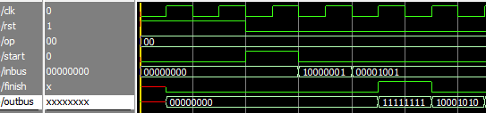
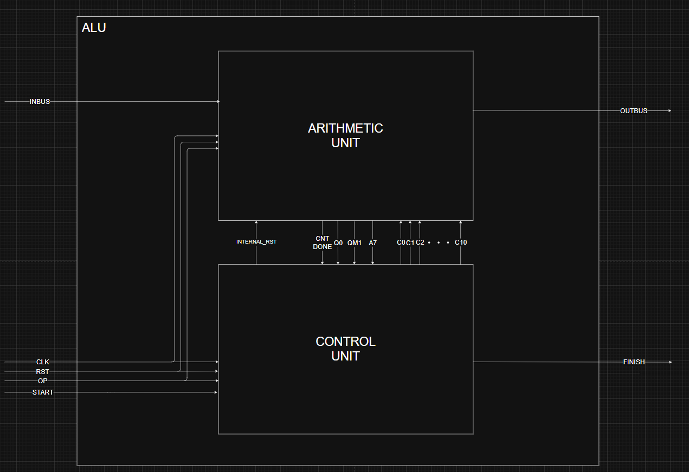
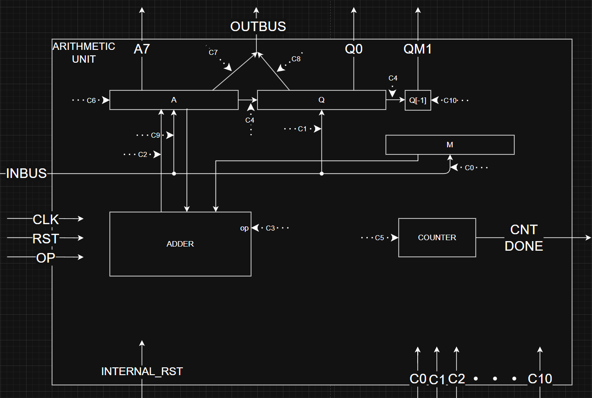
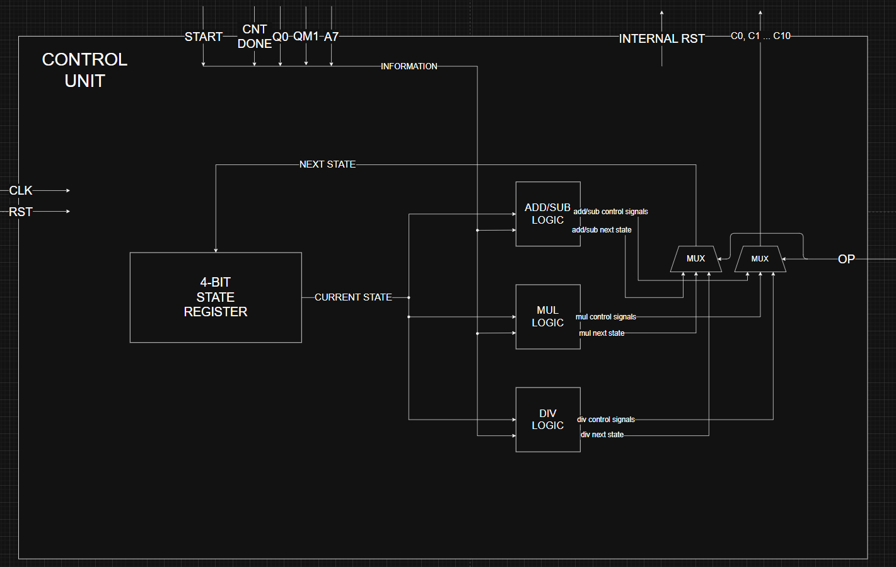
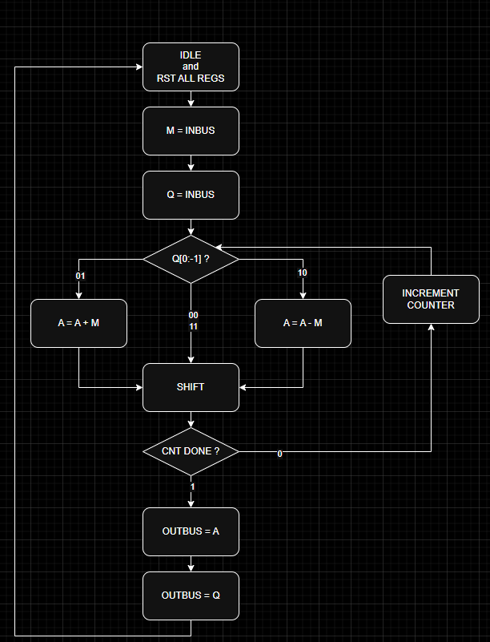
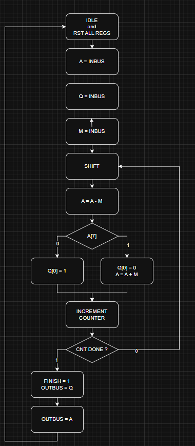

# **8-bit ALU**

## **Overview**

An 8-bit ALU capable of addition, subtraction, multiplication and division.
- Designed structurally, emphasizing the hardware components rather than behavioral descriptions.
- Separate *Control Unit* and *Arithmetic Unit* module implementations  
- Includes an extensive and easy to use *testbench*

## **I/O Interface**

The top-level interface of the ALU operates as follows:
### 1. Control signals
 - `rst`: 1-bit signal to set all registers to 0. Only needed before the first operation when starting the ALU.
 - `op`: 2-bit signal that determines the operation to be performed. Its value should remain constant until the operation is complete.
   - 00 - addition
   - 01 - subtraction
   - 10 - multiplication
   - 11 - division
 - `start`: 1-bit signal that initiates the operation.

### 2. Inputs
- `inbus`: 8-bit signal used to provide both operands. 
   - The first operand is provided on the first positive edge of the clock after the *start* signal is activated. The second operand is provided on the next positive edge of the clock.
   - [division only] As my implementation of division divides a 16-bit number by an 8-bit one, the input is done in 3 clock cycles. First, the most significant 8 bits of the dividend, then its least significant 8 bits, and lastly, the divisor.

### 3. Outputs
- `finish`: 1-bit signal indicating the completion of the operation.
- `outbus`: 8-bit signal used to output the result.
   - The first part of the result (quotient in the case of division) is provided on the same clock cycle as the *finish* signal is on. The second part of the result (remainder in the case of division) is provided in the following clock cycle.

### Example of I/O cycle:

## **System Diagram**

### Main modules:
 - `control_unit`: handles the FSM state registers and sends the *arithmetic_unit* control signals
 - `arithmetic_unit`: does operations on the numbers when the *control_unit* tells it to

## **arithmetic_unit**

#### Modules:
 - **`shift_reg_16`**: 16-bit shift register that holds A and Q.
 - **`extraQ`**: 1-bit register to hold Q[-1]. Is only needed for multiplication.
 - **`adder`**: 8-bit adder. Can also be used as a subtractor.
 - **`counter`**: 3-bit counter. Only increments when a signal `incr` is active.
 - **`reg_8`**: 8-bit register used to hold M.

## **control_unit**

### Modules:
 - **`reg_4`**: 4-bit register to hold the current state of the FSM
 - **`logic modules`**: as each operation has its own set of steps, each has its own FSM. In my design, I chose to use a single 4-bti register that is shared by all of the FSM's. I achieved this by only enabling the logic module corresponding the current operation. Additionally, to prevent choosing the wrong state, the output of each logic module is MUX'd based on the `op` signal. There is one logic module for *multiplication*, 1 for *division* while *addition* and *subtraction* share a module

### Control signals:
- `c0`: load input to M
- `c1`: load input to Q
- `c2`: load result from adder to A
- `c3`: tell adder which operation to do 0=add 1=sub
- `c4`: = enable_shift = while this is on, A and Q will shift on every clock cycle, shift direction depends on operation 
- `c5`: = increment counter = while this is on, cnt will increment on every clock cycle
- `c6`: input bit for bit shift
- `c7`: load A to outbus
- `c8`: load Q to outbus
- `c9`: load input to A
- `c10`: only load Q[0] with value from c6

## **Complex operations**

### multiplication
The algorithm implemented for multiplication is Booth Radix-2

### division
The algorithm implemented for division is Restoring Division

## **Resources**

- [ModelSim](https://www.intel.com/content/www/us/en/software-kit/750368/modelsim-intel-fpgas-standard-edition-software-version-18-1.html) - simulating the ALU
- [Digital](https://github.com/hneemann/Digital) - designing the low-level circuits like shift register, counter and adder
- [LogicFriday](https://download.cnet.com/logic-friday/3000-20415_4-75848245.html?ex=WLS-2202.2) - next-state FSM logic
- [Drawio](https://www.drawio.com) - the diagrams and flowcharts seen in this README

